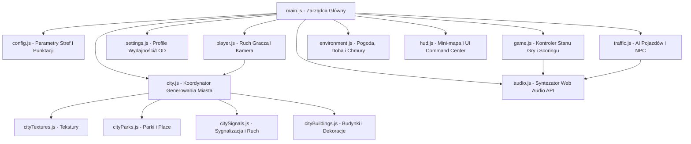

# CrossGuard — Dokumentacja Techniczna i Przewodnik Edukacyjny

Projekt **CrossGuard** to zaawansowany, edukacyjny symulator 3D ruchu pieszego i bezpieczeństwa miejskiego, stworzony w ramach konkursu **Motorola Solutions Science Cup 2026**. Gra została zaimplementowana w czystym JavaScript (ES Modules) przy użyciu biblioteki **Three.js (r170)** i interfejsów Web APIs (w tym Web Audio API dla pełnej syntezy dźwięków), bez konieczności stosowania narzędzi budujących (no-build setup).

Niniejszy plik stanowi wyczerpujący podręcznik techniczny, który wyjaśnia architekturę projektu, matematykę stojącą za zjazdami i zaokrąglonymi krawędziami wyspy, logikę syntezy audio oraz zasady działania sztucznej inteligencji pojazdów.

---

## 1. Architektura Systemu i Przepływ Danych

CrossGuard działa w oparciu o architekturę modułową. Gra ładowana jest jako moduł ES (`src/main.js`), który koordynuje inicjalizację sceny 3D, pętlę renderowania (Render Loop) oraz komunikację między modułami:



### Główna Pętla Gry (Render Loop)
Pętla opiera się na standardowym `requestAnimationFrame`. W każdej klatce wyliczany jest czas delta (`dt`), który następnie dystrybuowany jest do poszczególnych komponentów:
1. **Ruch gracza** (`player.update(dt)`): Gracz przemieszcza się, wyliczane są kolizje, a kamera płynnie podąża za nim.
2. **AI Pojazdów** (`traffic.update(dt)`): Samochody poruszają się po siatce dróg i zakrzywionych rampach, reagując na światła oraz gracza.
3. **Atmosfera sceny** (`environment.update(dt)`): Chmury dryfują, deszcz/śnieg opadają, a słońce przesuwa się po niebie.
4. **Odświeżanie HUD** (`hud.update(dt)`): Mini-mapa Canvas2D rysuje aktualne pozycje, aktualizowany jest czas i alerty.
5. **Culling (Optymalizacja)** (`city.cullScene(camera)`): Ukrywanie obiektów (drzew, budynków, odległych wysp) znajdujących się poza stożkiem widzenia kamery (Frustum Culling) lub za daleko.

---

## 2. Szczegółowy Opis Plików Projektu

### [src/main.js]
Główny punkt wejścia aplikacji. Odpowiada za:
*   **Inicjalizację Three.js**: Tworzenie instancji `WebGLRenderer`, `Scene`, oraz `PerspectiveCamera`.
*   **Obsługę ekranów UI**: Przełączanie stanów gry (Menu główne, Ekran gry, Ekran wyników, Ustawienia graficzne).
*   **Game Loop**: Funkcja `_animate(timestamp)` obliczająca `dt` i wywołująca aktualizację pozostałych modułów.
*   **Zapis postępu**: Moduł wczytuje i zapisuje odblokowane dzielnice w `localStorage` (klucz `crossguard_progress`).

### [src/core/config.js]
Baza danych i konfiguracja gry. Zawiera:
*   **PALETTE**: Kolory obiektów miejskich (drogi, chodniki, budynki, trawa).
*   **ZONES**: Definicje 5 stref operacyjnych (Dzielnica Mieszkalna, Szkolna, Centrum, Przemysłowa, Autostrada). Każda strefa definiuje parametry takie jak:
    *   Rozmiar siatki ulic (`gridSize`), natężenie ruchu pieszego/kołowego (`trafficDensity`),
    *   Prawdopodobieństwo zdarzeń losowych (np. awaria świateł, pojazd jadący na czerwonym świetle),
    *   Warunki pogodowe i porę dnia.
*   **SCORING**: Wartości punktowe za dobre i złe zachowania (np. przejście na zielonym, potrącenie, korzystanie z telefonu).

### [src/core/game.js]
Zarządca logiki rozgrywki (Gameplay Manager). Monitoruje:
*   **Stan misji**: Pozycję gracza względem punktu docelowego.
*   **Safety Score**: System punktacji (0-100), który dynamicznie reaguje na wykroczenia i poprawne zachowania.
*   **Wykrywanie kolizji / potrąceń**: Rejestruje wejście na jezdnię poza pasami lub przejście na czerwonym świetle.
*   **Generowanie zdarzeń dynamicznych**: Losuje i aktywuje sytuacje awaryjne (np. pojazd uprzywilejowany z syreną jadący przez miasto).

### [src/entities/player.js]
Kontroler gracza (postać "Alex Nawigant") oraz kamery:
*   **Kamera TPP (Third-Person)**: Kamera porusza się po sferze wokół gracza (promień sferyczny r, kąty theta i phi) sterowana ruchami myszy.
*   **Kamera FPP (First-Person)**: Opcjonalny widok z oczu bohatera przełączany klawiszem `V`.
*   **Fizyka ruchu**: Postać porusza się za pomocą klawiszy WASD/strzałek. Zastosowano wektory kierunkowe kamery do poruszania postaci relatywnie do widoku na ekranie.
*   **Kolizje pieszego**: Gracz posiada cylindryczną tarczę kolizji. Wykrywane są kolizje z budynkami, latarniami i barierami obwodowymi miasta (blokowanie ruchu za pomocą AABB - Axis-Aligned Bounding Box).

### [src/city/city.js]
**Koordynator i orkiestrator generowania miasta**. Definiuje klasę `City` oraz zarządza główną sekwencją budowania:
*   **Struktura klasowa i orkiestracja**: Odpowiada za konstruktor, inicjalizację siatki współrzędnych (`xCoords`, `zCoords`) oraz główną metodę `_build()`.
*   **Warstwy latającej wyspy (Skyblock)**: Tworzy 3 główne warstwy wiszącego lądu wraz z wiszącymi pod spodem formacjami skalnymi (stalaktytami).
*   **Detekcja i fizyka**: Sprawdza, czy pozycja gracza znajduje się na drodze, chodniku, przejściu lub koliduje z budynkiem/przeszkodą.
*   **Culling (Optymalizacja)**: Metoda `cullScene(camera)` ukrywa obiekty (drzewa, ławki, budynki) poza zasięgiem wzroku lub odległością optymalną, zmniejszając obciążenie GPU.
*   **Integracja modułów**: Dołączanie metod z plików pomocniczych do prototypu i statycznych metod klasy `City`.

### [src/city/cityTextures.js]
**Generator tekstur proceduralnych**. Odpowiada za dynamiczne rysowanie tekstur na płótnie (Canvas 2D) i konwersję do tekstur Three.js:
*   **Tekstury asfaltu i krawężników**: Generuje bazy, szumy, spękania i plamy oleju wraz z mapami wypukłości (Bump Maps).
*   **Tekstury chodników**: Tworzy grid płyt betonowych z przesunięciami krawędzi oraz losowym cieniowaniem poszczególnych płyt.
*   **Prywatna pamięć podręczna**: Przechowuje wygenerowane tekstury w pamięci modułu (`_textureCache`), zapobiegając ich ponownemu tworzeniu.

### [src/city/cityParks.js]
**Generator terenów zielonych**. Zarządza budowaniem stref rekreacyjnych:
*   **Parki miejskie (`_buildPark`)**: Generuje trawiaste podłoże, krzyżujące się żwirowe ścieżki, gęste żywopłoty, drzewa i ławki.
*   **Place miejskie (`_buildPlaza`)**: Generuje rynki z centralną fontanną kołową (basen, woda, tryskacz) stanowiącą przeszkodę kolizyjną, latarniami i drzewami dekoracyjnymi na rogach.

### [src/city/citySignals.js]
**Systemy ruchu i infrastruktura drogowa**. Odpowiada za wyposażenie ulic w elementy kontrolne i oświetleniowe:
*   **Linie i pasy drogowe**: Rysuje przerywane linie pasów ruchu oraz pasy przejść dla pieszych (zebra) o zróżnicowanym stopniu zużycia farby.
*   **Sygnalizacja świetlna**: Tworzy trójwymiarowe sygnalizatory drogowe oraz dwustanowe sygnalizatory dla pieszych, koordynując ich fazy i efekty poświaty (halos).
*   **Fale zielone (`_linkTrafficLights`)**: Realizuje synchronizację świateł na głównych arteriach komunikacyjnych w celu poprawy płynności ruchu.
*   **Kamery Avigilon**: Generuje słupy z modelami kamer CCTV o wysokiej szczegółowości, które monitorują skrzyżowania pod kątem wykroczeń.
*   **Znaki drogowe i przeszkody**: Rysuje znaki pionowe (np. D-6, A-7, D-1) oraz dodaje strefy robót drogowych (pachołki z biało-czerwonymi pasami).

### [src/city/cityBuildings.js]
**Generator zabudowy miejskiej i małej architektury**:
*   **Zabudowa z modeli (`_buildBuildingsFromModels`)**: Rozmieszcza budynki z bazy modeli GLTF/OBJ z uwzględnieniem spójnego skalowania (`BUILDING_SCALE = 10.0`) dopasowanego do postaci gracza oraz inteligentnego upakowania do 4 budynków na blok.
*   **LOD (Level of Detail)**: Dla odległych budynków stosuje prostsze, zastępcze bryły (boxy), optymalizując renderowanie.
*   **Zabudowa uproszczona (`_buildBuildingsSimple`)**: Tworzy budynki proceduralne z oknami, gzymsami i antenami w przypadku braku modeli trójwymiarowych.
*   **Roślinność i meble miejskie**: Generuje drzewa (pnie i geometryczne korony) oraz ławki parkowe.
*   **Widmowe wyspy (`_buildGhostIslands`)**: Tworzy odległe wyspy z domkami i lasami pływające w tle w celu nadania głębi paralaksy całemu światu.

### [src/entities/traffic.js]
Zarządza autonomicznym ruchem pojazdów i pieszych NPC:
*   **Siatka drogowa**: Pojazdy poruszają się wzdłuż segmentów dróg (`roadSegments`).
*   **Fizyka ramp**: Wylicza pozycję Y oraz pochylenie (pitch) samochodów wjeżdżających i zjeżdżających z wyspy.
*   **Inteligentne hamowanie**: Pojazdy wykrywają przeszkody przed sobą za pomocą prostego Raycastingu w kierunku jazdy (wykrywanie innych aut, świateł czerwonych oraz gracza).
*   **Stagger spawning**: Zapobiega spawnowaniu aut jedno na drugim na dole ramp poprzez wprowadzenie opóźnienia i kontroli odległości.

### [src/city/environment.js]
System pogodowy i oświetleniowy:
*   **Cykl dobowy**: Obraca kierunkowe źródło światła (Słońce/Księżyc), płynnie interpolując kolor nieba, oświetlenia oraz mgłę (`THREE.FogExp2`).
*   **Efekty cząsteczkowe**: Deszcz i śnieg generowane za pomocą `THREE.Points` z dynamicznie aktualizowanymi pozycjami wierzchołków.
*   **Wielowarstwowe Chmury**: Dryfujące chmury opisane w sekcji 4.

### [src/systems/hud.js]
Obsługuje interfejs Command Center (HUD):
*   **Mini-mapa (Canvas 2D)**: Rysuje uproszczoną mapę miasta w czasie rzeczywistym. Gracze, cele, kamery, radiowozy i zagrożenia są transformowani z przestrzeni 3D na płaszczyznę 2D za pomocą macierzy transformacji.
*   **Assist AI & APX P25 Radio**: Wyświetla wiadomości dyspozytora i komunikaty radiowe.
*   **Dev Overlay**: Pokazuje liczbę FPS, koordynaty oraz liczbę aktywnych obiektów.

### [src/systems/audio.js]
Syntezator dźwięku. **Nie ładuje plików MP3/WAV** - wszystkie efekty generuje programowo w locie przy użyciu `AudioContext` z Web Audio API. Szczegółowo opisany w sekcji 5.

### [src/systems/cinematic.js]
Zarządza efektami kinowymi, kamerą wprowadzającą (intro) oraz przerywnikami filmowymi.

### [src/core/settings.js] & [src/entities/modelLoader.js]
Odpowiadają odpowiednio za zarządzanie profilami jakości graficznej (LOD, cienie, gęstość obiektów) oraz ładowanie modeli GLTF/GLB (lub tworzenie zastępczych brył low-poly, jeśli modele się nie załadują).

---

## 3. Matematyka Ramp Zjazdowych i Zaokrąglonych Narożników

Wisząca wyspa w CrossGuard posiada zaawansowaną geometrię zboczy i ramp zjazdowych. Zamiast płaskich, pionowych krawędzi, teren płynnie zakrzywia się ku dołowi, imitując naturalne zbocza góry.

```
Poziom miasta (y = 0.12)
   |
   +-----+ (Początek rampy/zbocza przy r = 0)
         \
          \--_
              \__
                 \
                  +-----+ (Dno przepaści / koniec rampy, y = -19.88 przy r = 25)
```

### Matematyczna krzywa zjazdu (Rampy)
Rampy drogowe, po których poruszają się samochody, są generowane jako zbiór segmentów ułożonych wzdłuż sinusoidy. Dla rampy o długości $L = 30$ i głębokości $D = 20$, współrzędna wysokości $y$ w punkcie $t \in [0, 1]$ (gdzie $t=0$ to dół rampy, a $t=1$ to poziom miasta) jest określona wzorem:
$$y(t) = -D \cdot (1 - \sin(t \cdot \frac{\pi}{2}))$$

Nachylenie rampy (kąt pochylenia $\theta$ wzdłuż osi jazdy) obliczane jest jako pochodna wysokości względem położenia:
$$\frac{dy}{dx} = \frac{D}{L} \cdot \frac{\pi}{2} \cdot \cos(t \cdot \frac{\pi}{2})$$
$$\theta = \arctan\left(\frac{dy}{dx}\right)$$

Ten kąt nachylenia jest bezpośrednio aplikowany do rotacji segmentów drogi w Three.js, a w klasie `Traffic` służy do płynnego pochylania (pitch) pojazdów podczas jazdy w dół lub w górę.

### Zaokrąglone, opadające narożniki (Concentric Sloped Rings)
W najnowszej wersji projektu rogi wyspy nie są kwadratowe, lecz zaokrąglone w ćwierćokrąg o promieniu $R = 25$ jednostek i opadają w dół pod tym samym kątem co drogi.

Aby uzyskać ten kształt bez powstawania pionowych ścianek szczelinowych (Z-fighting) na łączeniach z drogami, rogi budowane są z **16 koncentrycznych pierścieni** (segmentów ring-sector) przy użyciu `THREE.Shape` i `THREE.ExtrudeGeometry`. 

Dla każdego pierścienia $k$ od $0$ do $15$:
1.  Obliczany jest promień wewnętrzny $r_1 = \frac{k}{16} \cdot R$ oraz zewnętrzny $r_2 = \frac{k+1}{16} \cdot R$.
2.  Wyznaczany jest punkt środkowy $t_{mid} = \frac{k + 0.5}{16}$.
3.  Wysokość segmentu $y_{mid}$ jest definiowana krzywą cosinusoidalną pasującą do ramp:
    $$y_{mid}(t_{mid}) = 0.12 - D \cdot (1 - \cos(t_{mid} \cdot \frac{\pi}{2}))$$
4.  **Generowanie kształtu w 2D**:
    *   Jeśli $r_1 = 0$, rysowany jest pełny wycinek koła (od $(0,0)$ do łuku o promieniu $r_2$).
    *   Jeśli $r_1 > 0$, ścieżka rysowana jest od wewnętrznego promienia, biegnie po łuku zewnętrznym $r_2$ (przeciwnie do ruchu wskazówek zegara), schodzi do promienia $r_1$ i wraca po wewnętrznym łuku (zgodnie z ruchem wskazówek zegara):
        ```javascript
        shape.moveTo(r1 * Math.cos(startAngle), r1 * Math.sin(startAngle));
        shape.absarc(0, 0, r2, startAngle, endAngle, false); // Łuk zewnętrzny
        shape.lineTo(r1 * Math.cos(endAngle), r1 * Math.sin(endAngle));
        shape.absarc(0, 0, r1, endAngle, startAngle, true);  // Łuk wewnętrzny (powrotny)
        ```
5.  Kształt ten jest wytłaczany (`ExtrudeGeometry`) w dół (w osi Y) na grubość $0.2$ dla trawy oraz $12.0$ dla skalnego spodu, co tworzy idealnie gładkie, organiczne zbocze wyspy.

---

## 4. Wielowarstwowe Chmury i Ruchome Tło (Skyblock)

CrossGuard wykorzystuje zaawansowany system dynamicznego środowiska 3D w celu wywołania u gracza efektu przebywania na ogromnej wysokości (tzw. "Skyblock Fantasy"):

### 1. Dryfujące Chmury (Clouds System)
W klasie `Environment` generowanych jest 35 dużych chmur (HQ). Każda chmura to `THREE.Group` składająca się z 6 do 12 spłaszczonych sfer (`scale(1.5, 0.45, 1.5)`) o wysokiej chropowatości (`roughness: 0.98`) i niskim współczynniku odbicia światła, co daje efekt puszystości. 

Chmury dystrybuowane są na trzech poziomach wysokościowych:
*   **Warstwa Dolna** ($y \in [-70, -35]$): Stanowi 60% wszystkich chmur. Tworzy gęste "morze mgły" bezpośrednio pod wyspą, zasłaniając pustkę pod sceną.
*   **Warstwa Średnia** ($y \in [-15, 15]$): Stanowi 25% chmur. Są to pojedyncze chmury i mgły przelatujące na wysokości ulic miasta, tworzące efekt wiszącej w chmurach metropolii. Spawnowane są w odległości powyżej 140 jednostek od środka wyspy, aby nie blokować widoku kamery gracza.
*   **Warstwa Górna** ($y \in [70, 110]$): Stanowi 15% chmur, które płyną wysoko nad głową pieszego.

Chmury poruszają się z losową prędkością w osiach X i Z. Kiedy chmura przekroczy granicę $400$ jednostek od środka sceny, jest automatycznie przenoszona na drugą stronę sceny (Wrap-around):
```javascript
if (position.x > 400) {
  position.x = -400;
  position.z = (Math.random() - 0.5) * 800;
}
```

### 2. Widmowe Wysepki (Ghost Islands)
Zamiast tradycyjnego skyboxa z wieżowcami, w tle generowanych jest 30 mniejszych, wiszących wysp pomocniczych (`_buildGhostIslands()` w `city.js`).
Każda wyspa posiada:
*   Własną zieloną powierzchnię i skalną, stożkową podstawę z wiszącymi stalaktytami.
*   Miniaturowy domek (chatkę) z podświetlanym oknem (`MeshBasicMaterial` z emisyjnym kolorem żółtym o opacisiti 0.8).
*   Grupę małych sosenek o uproszczonej geometrii.
Wyspy te są generowane w odległościach $d \in [half + 45, half + 265]$ i na wysokościach $y \in [-50, 10]$, co sprawia, że horyzont żyje i ma głębię paralaksy podczas ruchu kamery.

---

## 5. Synteza Audio przy użyciu Web Audio API

Jednym z najbardziej unikalnych elementów CrossGuard jest **brak plików dźwiękowych (MP3, WAV)**. Cała ścieżka dźwiękowa (ambient, efekty, syreny, APX chirp) jest syntetyzowana programowo za pomocą kodu w pliku `audio.js`.

### Jak działa synteza w Web Audio API?
Web Audio API tworzy graf połączeń (Audio Graph), w którym węzły źródłowe (Oscylatory, Generatory Szumu) są łączone z węzłami modyfikującymi (Filtry, Wzmocnienia) i wysyłane do wyjścia głośnikowego (`audioContext.destination`).

```
[OscillatorNode (Source)] ---> [BiquadFilterNode] ---> [GainNode (Envelope)] ---> [Destination]
```

### Przykłady syntezy konkretnych dźwięków w projekcie:

#### 1. Dźwięk Syreny Policyjnej (`playSiren`)
Syrena wymaga modulacji częstotliwości (FM). Używane są dwa oscylatory: jeden jako źródło dźwięku (Carillon/Siren), a drugi jako modulator (LFO - Low Frequency Oscillator).
*   **Carrier (Nośna)**: Oscylator o przebiegu trójkątnym (`triangle`) generujący ton podstawowy (np. 600 Hz).
*   **Modulator (LFO)**: Oscylator o przebiegu sinusoidalnym pracujący z częstotliwością np. 1.5 Hz. Jest połączony z parametrem `frequency` oscylatora nośnej. Powoduje to płynne wahanie tonu syreny w górę i w dół (efekt *wail*).
*   **Wzmocnienie**: Płynny wzrost głośności (Attack) i spadek (Release) kontrolowany przez `GainNode`.

#### 2. Dźwięk Klaksonu Samochodowego (`playHorn`)
Klakson samochodowy nie jest czystym tonem sinusoidalnym. W naturze składa się z dwóch dominujących, lekko rozstrojonych częstotliwości o ostrym brzmieniu:
*   Tworzone są dwa oscylatory o fali piłokształtnej (`sawtooth`) o częstotliwościach np. 350 Hz oraz 355 Hz.
*   Lekkie rozstrojenie (detune) o 5 Hz wywołuje charakterystyczny efekt dudnienia i szorstkości klaksonu.
*   Sygnał przechodzi przez `BiquadFilterNode` (filtr dolnoprzepustowy) ustawiony na 1200 Hz, aby zaokrąglić ostre brzmienie fali piłokształtnej.

#### 3. Szum i Sygnał Radia APX P25 (`playRadioNoise` / `playAPXChirp`)
*   **Szum Radiowy**: Do generowania szumu (White Noise) tworzony jest bufor audio wypełniony losowymi liczbami z przedziału $[-1, 1]$ za pomocą algorytmu:
    ```javascript
    const bufferSize = audioCtx.sampleRate * 2; // 2 sekundy szumu
    const buffer = audioCtx.createBuffer(1, bufferSize, audioCtx.sampleRate);
    const data = buffer.getChannelData(0);
    for (let i = 0; i < bufferSize; i++) {
      data[i] = Math.random() * 2 - 1;
    }
    ```
    Szum ten jest następnie filtrowany pasmowo (Bandpass Filter) między 400 Hz a 2500 Hz, co daje efekt ograniczonego pasma starego głośnika radiotelefonicznego.
*   **APX Chirp (Sygnał rozpoczęcia transmisji)**: Synteza 3 szybkich, rosnących tonów sinusoidalnych (np. 900 Hz, 1200 Hz, 1500 Hz) granych w odstępach co 0.05 sekundy, co idealnie naśladuje autentyczny sygnał logowania Motorola APX do systemu trunkingowego ASTRO 25.

---

## 6. Przewodnik dla Programistów (Jak się z tego uczyć?)

Projekt CrossGuard został zaprojektowany z myślą o czytelności kodu i braku zależności. Jest to doskonały poligon doświadczalny do nauki grafiki 3D oraz programowania gier.

### Propozycje ćwiczeń edukacyjnych:

1.  **Modyfikacja fizyki jazdy (Rampy)**:
    *   *Gdzie szukać*: Otwórz [src/city/city.js] w sekcji generacji zjazdów oraz [src/entities/traffic.js] w metodzie `_updateVehicle`.
    *   *Zadanie*: Zmień głębokość ramp (`rampDepth`) z 20 na 40 jednostek. Zaobserwuj, jak pojazdy automatycznie dopasowują swój kąt pochylenia (pitch) i płynnie zjeżdżają w dół pod większym kątem bez odrywania się od drogi.
2.  **Stworzenie własnej strefy (Z dzielnicami)**:
    *   *Gdzie szukać*: Plik [src/core/config.js], obiekt `ZONES`.
    *   *Zadanie*: Dodaj nową strefę, np. `cyberpunk`. Skonfiguruj neonowe kolory palety, dodaj deszczową pogodę (`rain: true`), ustaw mgłę na fioletową i zmień natężenie ruchu samochodów na ekstremalne.
3.  **Dodanie nowego efektu dźwiękowego**:
    *   *Gdzie szukać*: Plik [src/systems/audio.js].
    *   *Zadanie*: Napisz funkcję syntezy dźwięku burzy (pioruna). Użyj generatora szumu (White Noise) z nagłym wzrostem głośności (Attack = 0.01s) i bardzo długim doomed czasem wygaszania (Release = 4.0s) oraz filtrem dolnoprzepustowym o odcięciu zmieniającym się w czasie (filtr schodzący w dół dla symulacji oddalającego się grzmotu).
4.  **Badanie kolizji gracza**:
    *   *Gdzie szukać*: Plik [src/entities/player.js].
    *   *Zadanie*: Znajdź sekcję sprawdzania kolizji z przeszkodami w metodzie `update`. Spróbuj zmienić promień kolizyjny gracza (np. do 5 jednostek) i zobacz, jak Alex reaguje na zbliżanie się do budynków i barier.

---

## 7. Jak uruchomić projekt lokalnie

Gra korzysta z modułów ES6, dlatego przeglądarki ze względów bezpieczeństwa (CORS) blokują jej uruchomienie bezpośrednio z pliku (`file:///index.html`). Wymagany jest prosty serwer HTTP.

### Krok 1: Klonowanie i przejście do folderu gry
```bash
cd motorola/crossguard
```

### Krok 2: Uruchomienie serwera deweloperskiego

*   **Opcja A: Python 3** (najprostsza, zazwyczaj preinstalowana na macOS/Linux):
    ```bash
    python3 -m http.server 8081
    ```
*   **Opcja B: Node.js / npm**:
    ```bash
    npm install -g serve
    serve -l 8081
    ```

### Krok 3: Otwarcie w przeglądarce
Wejdź na adres: [http://localhost:8081]

*Wskazówka: Naciśnij klawisz `F12`, aby otworzyć konsolę deweloperską przeglądarki i śledzić logi diagnostyczne symulatora w czasie rzeczywistym!*
